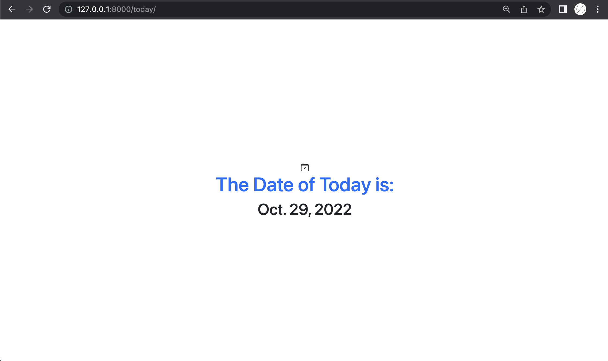
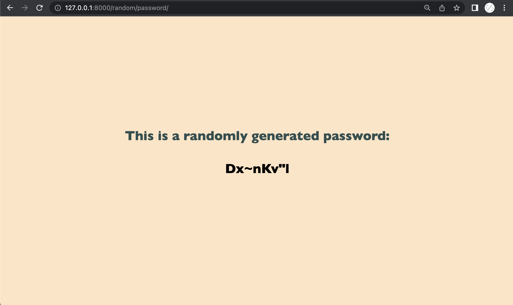
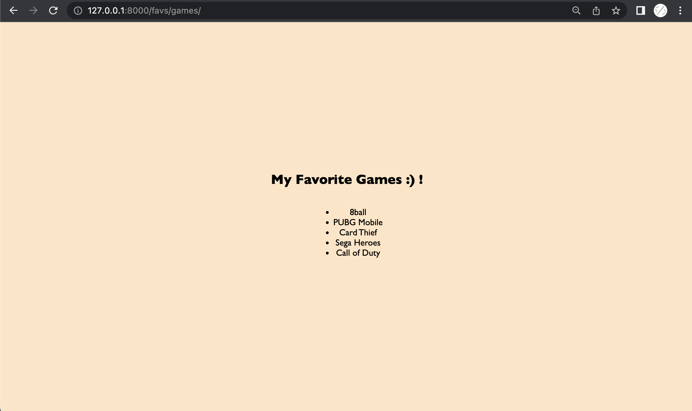
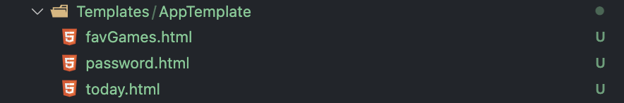

# LAB_DJANGO_TEMPLATES

# Create a new website using Django . Your website should have the following paths :
### today/
  This should display the date of today .
  
### random/password/
  This should display a randomly generated password . 
  
### favs/games/
   This should display a list of your favorite games.
  

### Make sure to use templates for each of the above paths . 
